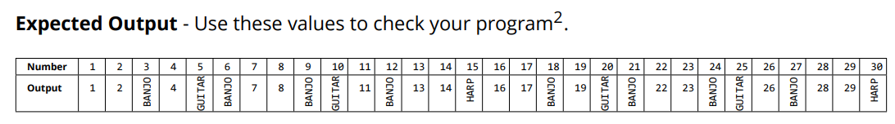

# Practical: Java Development Kit (JDK) and Basic Java

## Objective
This practical aims to familiarise you with the **Java Development Kit (JDK)** and basic Java concepts. You will create a Java program that loops through numbers and outputs specific strings based on divisibility rules.

## Task Overview
You are required to create a class named `Twang`. The class will loop through numbers from `1` to `n` (inclusive) and print out each number unless one of the following conditions occurs:
- If the number is divisible by 3, output **BANJO**
- If the number is divisible by 5, output **GUITAR**
- If the number is divisible by both 3 and 5, output **HARP**

The value of `n` is provided as a command-line argument.

### Expected Output
Use the following values for testing your program:

- **Example**:
  

## Batch File: `build.bat`

Create a batch file called `build.bat` to automate the following tasks:

1. **Command Line Variables**:
    - Create command line variables for the required folders (relative to the main project folder).

2. **Set Environment Variables**:
    - Set `JAVA_HOME` and add the JDK `bin` folder to the system `PATH`.

3. **Compile Code**:
    - Use `javac` to compile the Java code located in the `src` folder and output the compiled class files to the `bin` folder.
    - **Hint**: Use the variables you created for folder paths.

4. **Run Code**:
    - Use `java` to run the compiled class files in the `bin` folder.

5. **Decompile Class**:
    - Use `javap` to decompile the class file in the `bin` folder and save the output to a file called `ByteCode.txt`.
    - Place the `ByteCode.txt` file in the `docs` folder.

## Additional Task
- **Array Output**:
    - Create an array to store the output.
    - Process the numbers and store the result in the output array.
    - Display the output by looping over the array.

