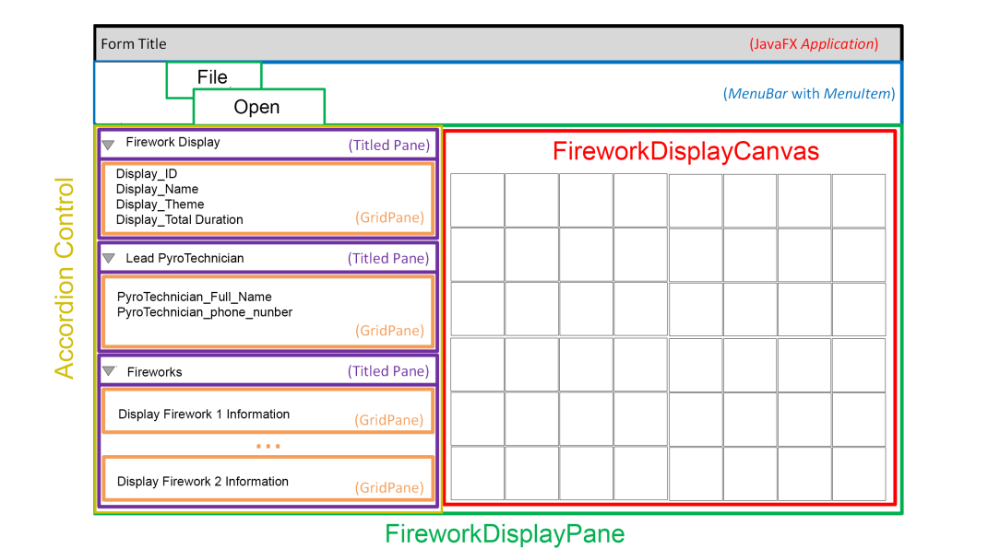

# Practical: Advanced OO, JavaFX GUI, and Visitor Design Pattern

## Overview

This practical aims to enhance your understanding of Advanced Object-Oriented Programming (OO), JavaFX GUI development, and the Visitor Design Pattern. You will create a modern GUI for the Firework Management Bureau (FMB) application, visualizing firework displays on a 15x15 grid. You will also integrate the Visitor Design Pattern to manage the drawing of different types of firework entities.

## Objectives

1. **Create FireworkDisplayCanvas Class**: Develop a class to visualize the firework display on a grid.
2. **Implement Visitor Design Pattern**: Update classes to use the Visitor Design Pattern for drawing entities.
3. **Create FireworkDisplayPane Class**: Design a GUI pane to handle file selection and display firework information.
4. **Update Main Class**: Modify the `Main` class to launch the JavaFX application and display the GUI.

## Components

### FireworkDisplayCanvas Class

- **Package**: `acsse.csc2a.fmb.gui`
- **Inherits**: `Canvas`
- **Attributes**:
    - `ArrayList<FireworkEntity>`: List of firework entities to display.
- **Methods**:
    - `redrawCanvas()`: Draws a 15x15 grid with cells of 50x50 pixels. Renders each firework according to its type:
        - **RocketFirework**: Drawn as a rectangle with height greater than width.
        - **FountainFirework**: Drawn as a circle.
    - Fireworks are colored based on their `E_COLOUR` and rotated according to their angle.

### Visitor Design Pattern

1. **AbstractVisitable Interface**: Define methods for accepting visitors.
2. **AbstractVisitor Interface**: Define methods for visiting different types of visitable entities.
3. **ConcreteVisitor Class**: Implement the drawing logic for different firework types.
4. **Update Entity Classes**: Modify `Entity` classes to use the visitor pattern for drawing.

### FireworkDisplayPane Class

- **Package**: `acsse.csc2a.fmb.gui`
- **Inherits**: `StackPane`
- **Components**:
    - `DisplayBundle`: Created by `OrchestrationFileHandler.readLayoutFile` to provide `ArrayList<FireworkEntity>` and display data.
    - `FireworkDisplayCanvas`: For displaying the firework grid.
    - `MenuBar`: Includes a `MenuItem` to open a file chooser for selecting a layout binary file.
    - `Accordion`: Contains `TitledPane` and `GridPane` for displaying firework display information.
- **Layout**:
    - Dock the Firework Display information to the left.
    - Center the `FireworkDisplayCanvas` in the scene.

### Main Class

- **Updates**:
    - Extend `Application` (from `javafx.application.Application`).
    - Remove unnecessary imports.
    - Implement the `start` method to initialize the JavaFX application.
    - Instantiate `FireworkDisplayPane`, add it to a `Scene`, and display it on the `Stage`.

## Provided Files

- **p07.jar**: Contains necessary classes and JavaDoc for the practical.
- **FD0001.txt**: Text file with FireworkDisplay information (ID “FD0001”).
- **layout_1.dat**: Binary file containing orchestration information.

## Example Layout

## Implementation Steps

1. **Create FireworkDisplayCanvas**:
    - Implement the class extending `Canvas`.
    - Define and implement the `redrawCanvas` method to visualize the firework display.

2. **Implement Visitor Design Pattern**:
    - Define `AbstractVisitable` and `AbstractVisitor` interfaces.
    - Implement `ConcreteVisitor` for drawing fireworks.
    - Update `Entity` classes to integrate the visitor pattern.

3. **Create FireworkDisplayPane**:
    - Implement the class extending `StackPane`.
    - Add components like `FireworkDisplayCanvas`, `MenuBar`, and `Accordion`.
    - Ensure proper layout for components.

4. **Update Main Class**:
    - Modify the `Main` class to use JavaFX.
    - Implement the `start` method to set up the application.
    - Launch the application and display the `FireworkDisplayPane`.

## Notes

- Ensure to follow the provided JavaDoc and `p07.jar` for guidance.
- Validate that all classes are correctly placed in the `acsse.csc2a.fmb` subpackages.
- Test the application thoroughly to ensure that all components function as expected.

